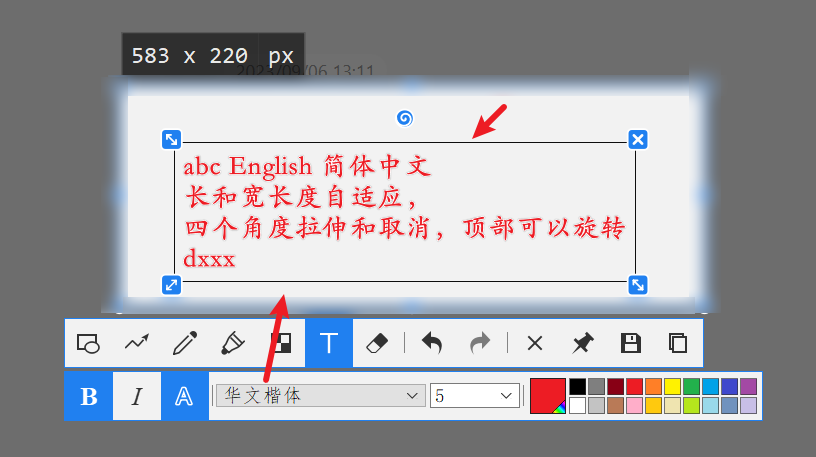

## 今天的参考

已修复一个bug：双击时，输入框的光标位置不对（尤其是多行文本时候）

但是还存在bug（终究不是真正的 Edit 控件，网上的修改了下，但是人依旧有问题）：

1. **输入中文时候，系统的输入框位置不在光标附近，在我的win10屏幕的右下角**
2. ctrl a 全选， ctrl-c 等快捷键作用都没有，反而是会插入未知的符号

## 最终目的

我想实现一个自定义控件，类似 Snipaste 的【文本编辑框控件】
效果如下：  我希望是继承于 QAbstractGraphicsShapeItem，因为我是使用 view 来控制此控件；

若有不确定，可qq联系

